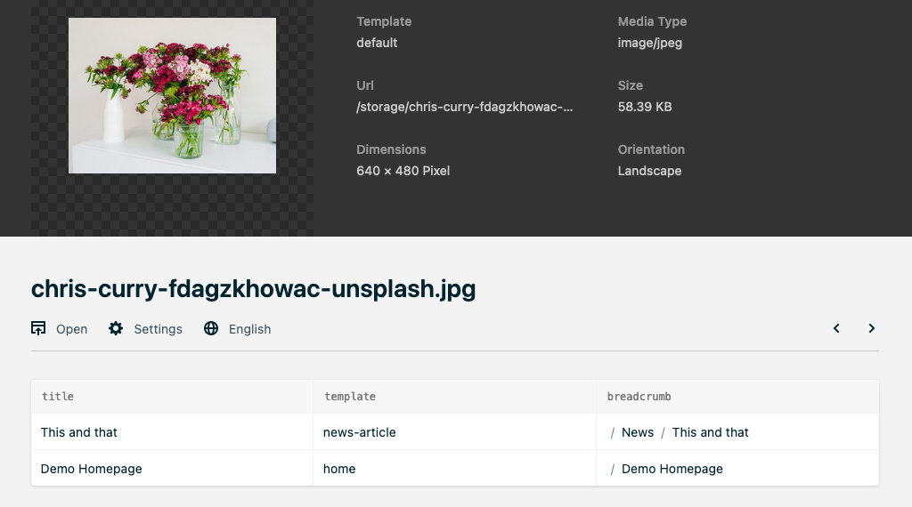

# Kirby usage reference plugin
Infosection to display all references to a page in a list.



## Install
### Download Zip file

Copy plugin folder into `site/plugins`

### Git submodule
```
git submodule add https://github.com/visionbites/kirby-usage-reference.git site/plugins/usage-reference
```

### Composer
```
composer require visionbites/usage-reference
```

## Usage
Add a section `usageReference` to your blueprint to show references to the current page.
Add a `template` key to define the type of pages you are looking for.


### Example
Basic setup:

```yaml
sections:
    references:
        headline: References to this page
        type: usageReference
        template: template-name
```

Setup for files:

```yaml
sections:
    file_data:
        type: fields
        fields:
            title:
                type: text
                label: Title
            alt:
                type: text
                label: Alternative title
            caption:
                type: textarea
                label: Image caption
    references:
        headline: References to this file
        type: usageReference
```

## Options

there is only one option at the moment:

| Option   | Default | Description                                                                              |
|----------|---------|------------------------------------------------------------------------------------------|
| `expire` | `15`    | the cache will expire after n minutes. Minimum is 1 as a indefinite cache makes no sense |


set the options in `config.php`:

```php
return [
	'visionbites.usage-reference' => [
		'expire' => 15 // in minutes
	],
];
```

please keep in mind that this might lead to showing out of date data to the editor if there was another reference added.


## todos
- [ ] clear cache for a page on update of a referencing page
- [ ] make it pick up on text links

## License

[MIT](https://opensource.org/licenses/MIT)

It is discouraged to use this plugin in any project that promotes racism, sexism, homophobia animal abuse, violence or any other form of hate speech.
